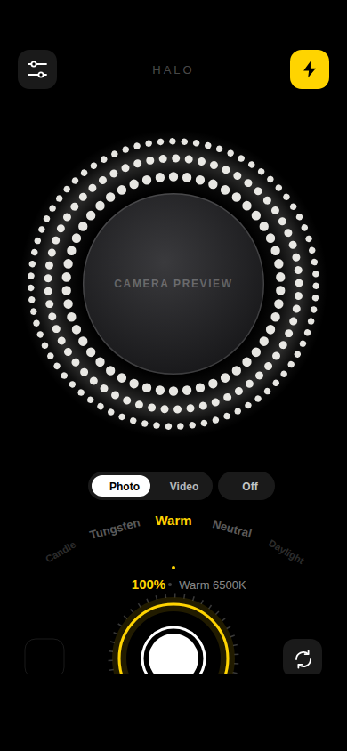
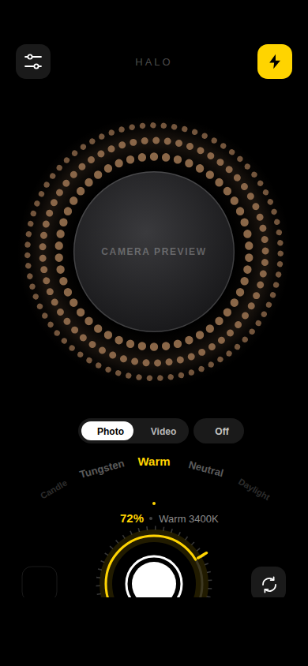
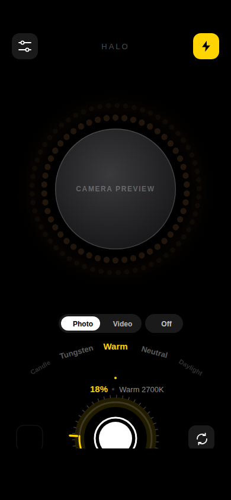

# Halo — selfie ring light

A ring light that happens to have a camera in the middle of it. The phone's own
panel is the lamp: a circle of light surrounds a round front-camera preview, and
a rotary dial controls how much of it you get.

Built with Expo SDK 57, React Native 0.86, TypeScript, NativeWind (Tailwind) and
Reanimated 4.

<p align="center">
  
  
  
</p>

<p align="center"><sub>
100% at 6500 K · 72% at 3400 K · 18% at 2700 K. These are renders produced by
feeding <code>lib/colour.ts</code> and <code>lib/geometry.ts</code> — the same
modules the app runs — into a static SVG, not device screenshots, so the
preview area is a placeholder. See <code>docs/</code>.
</sub></p>

## What it does

**The light is real, not decorative.** Three things move together when you turn
the dial:

- the rendered ring's luminance,
- which of the three dot rings are lit — they switch on from the inside out, so
  winding down collapses the light inward like a real dimmer,
- the hardware backlight, which is the single biggest lever on how much light
  lands on a face. Your original brightness is captured on the way in and handed
  back when you leave, background the app, or switch the light off.

**Colour temperature is physical.** Seven presets from 1900 K to 8000 K are
converted to sRGB along the Planckian locus (Tanner Helland's piecewise fit), so
"Tungsten" really is tungsten-coloured rather than a guessed shade of orange.

**Four ring styles**, which differ in the catchlight they leave in the eyes:

| Style  | Look                                             |
| ------ | ------------------------------------------------ |
| Dots   | Three counter-rotating rings of points (default) |
| Halo   | One continuous soft ring                         |
| Beauty | Wide feathered ring — softest shadows            |
| Flood  | Whole panel lit, preview punched out of it       |

**Capture.** Photos and video from either camera, a 3/10-second self timer, and
everything filed into a "Halo" album in the camera roll.

## Controls

| Gesture                       | Does                                    |
| ----------------------------- | --------------------------------------- |
| Turn the ring around the shutter | Intensity, with detents every 5%     |
| Swipe up/down on the light     | Intensity, coarse                       |
| Drag the curved row of names   | Colour temperature                      |
| Tap the light                  | Hide the controls; tap again to restore |
| Tap the yellow bolt            | Light on/off                            |

## Running it

```bash
npm install
npx expo start
```

The camera needs a real device or a development build — `expo-camera`,
`expo-brightness` and `expo-media-library` are native modules, so Expo Go will
not do. Build one with:

```bash
npx expo run:ios      # or run:android
```

## Layout of the code

```
app/
  _layout.tsx        Router, gesture root, dark theme
  index.tsx          Capture screen: permissions, brightness, shutter, timers
  settings.tsx       Ring style, temperature, behaviour toggles
components/
  RingLight.tsx      The light. Dot field, bloom, halo/beauty/flood styles
  CameraWindow.tsx   Round front-camera preview + the mask that rounds it
  IntensityDial.tsx  Rotary knob wrapping the shutter
  PresetArc.tsx      Curved temperature wheel
  ShutterButton.tsx  Morphing shutter/record button
lib/
  colour.ts          Kelvin → sRGB, the intensity curve, per-ring levels
  geometry.ts        Dot-field layout, arc paths, dial angle maths
  presets.ts         Temperatures and ring styles
  store.ts           Persisted settings (zustand + AsyncStorage)
  useScreenBrightness.ts  Backlight control with restore-on-exit
  useMediaSaver.ts   Saving into the Halo album
```

## Notes for anyone extending this

**Everything is painted above the camera preview.** On Android the camera
renders into a `PreviewView`, which defaults to a `SurfaceView` and ignores a
parent's rounded clip — so a plain `borderRadius` gives you a square preview on
some devices. `CameraWindow` instead punches a circular hole in an opaque mask
drawn *over* the preview, and `RingLight` draws on top of that mask. Keep that
order or the mask will eat the dots at the corners of the preview's bounding box.

**The dial never crosses the JS bridge while you drag it.** Intensity lives in a
Reanimated shared value; the ring, arc, marker and glow are all derived from it
on the UI thread. Only two things hop back to JS — a throttled backlight write
and the haptic detents — and both are gated on a whole-number change.

**Each dot ring is a single `<Path>`, not ~70 `<Circle>`s.** `dotsToPath` walks
the ring and emits two arcs per dot, which takes the dot field from a couple of
hundred nodes down to three animated views.

**The React Compiler is deliberately off.** The hot path here is entirely
worklets on the UI thread, so there is nothing for it to win. Turn it on by
adding `"reactCompiler": true` under `experiments` in `app.json` if you want it.

## Verifying changes

```bash
npm test           # assertions over the colour, curve and geometry maths
npm run typecheck  # tsc, strict + noUncheckedIndexedAccess + noUnusedLocals
npm run bundle     # proves Metro, Babel, NativeWind and Reanimated all agree
```

`npm test` runs in plain node via type stripping — no test runner, no native
deps. It covers the half of the app that can be checked without a device: the
Planckian conversion, the intensity curve and its per-ring falloff, whether any
dot can collide with the camera window or its neighbours, and the dial's
angle-wrap arithmetic.
