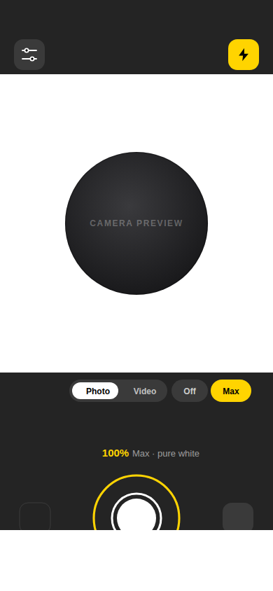
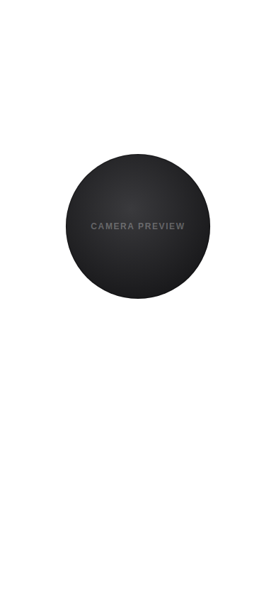
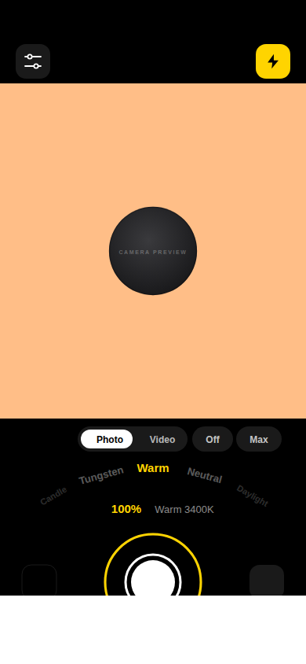
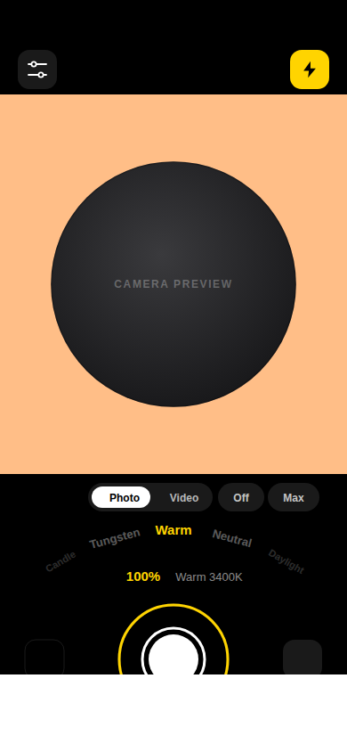

# Halo — selfie ring light

A ring light that happens to have a camera in the middle of it. The phone's own
panel is the lamp: a circle of light surrounds a round front-camera preview, and
a rotary dial controls how much of it you get.

Built with Expo SDK 57, React Native 0.86, TypeScript, NativeWind (Tailwind) and
Reanimated 4.

<p align="center">
  
  
  
  
</p>

<p align="center">
  
  
</p>

<p align="center"><sub>
Dots at 100%/6600 K and 72%/3400 K, Max mode with and without the controls,
then Flood pinched to each end of its range. These are renders produced by feeding <code>lib/colour.ts</code> and
<code>lib/geometry.ts</code> — the same modules the app runs — into a static
SVG, not device screenshots, so the preview area is a placeholder.
</sub></p>

## What it does

**The light is real, not decorative.** Three things move together when you turn
the dial:

- the rendered ring's luminance,
- which of the three dot rings are lit — they switch on from the inside out, so
  winding down collapses the light inward like a real dimmer,
- the hardware backlight, which is the single biggest lever on how much light
  lands on a face. Your original brightness is captured on the way in and handed
  back when you leave, background the app, or switch the light off.

**Colour temperature is physical.** Six presets from 1900 K to 6600 K are
converted to sRGB along the Planckian locus (Tanner Helland's piecewise fit), so
"Tungsten" really is tungsten-coloured rather than a guessed shade of orange.
The top of the range, **Max day**, sits at 6600 K, which is exactly where that
fit puts all three channels at 255 — pure white and the most luminous point
available, so it is the one to pick when you want light rather than a look.

**Five light styles**, which trade catchlight shape against raw output:

| Style  | Look                                                      |
| ------ | --------------------------------------------------------- |
| Dots   | Three counter-rotating rings of points (default)          |
| Halo   | One continuous soft ring                                  |
| Beauty | Wide feathered ring — softest shadows                     |
| Flood  | The area around the preview, in your chosen temperature   |
| Max    | Every pixel white, edge to edge, bar the preview          |

In the two flood styles the preview is a hole in a lit field, so **pinch to
resize it** — a smaller circle means more lit panel and more light. The ring
styles keep the default size, because their geometry is built around the window
radius.

**Max** is the one to reach for when you need light rather than a look, and it
has a chip on the main screen rather than living in Settings. It lights about
90% of the panel against roughly 3% for Dots, so it is not a little brighter —
it is a different order of magnitude. It ignores colour temperature on purpose:
any tint costs luminance, and pure white is the most a display can emit. Tap
the light to hide the controls and the whole screen becomes the lamp.

**Capture.** Photos and video from either camera, a 3/10-second self timer, and
everything filed into a "Halo" album in the camera roll.

## Controls

| Gesture                       | Does                                    |
| ----------------------------- | --------------------------------------- |
| Turn the ring around the shutter | Intensity, with detents every 5%     |
| Swipe up/down on the light     | Intensity, coarse                       |
| Drag the curved row of names   | Colour temperature                      |
| Tap the light                  | Hide the controls; tap again to restore |
| Tap the yellow bolt            | Light on/off                            |
| Tap **Max**                    | Full-screen white, and back again       |
| Pinch (Flood and Max)          | Resize the preview circle, 55%–135%     |

## Getting it on your phone

### Scan a QR and run it (fastest, no build)

```bash
npm install
npx expo start          # add --tunnel if your phone is on a different network
```

Install **Expo Go** from the App Store or Play Store, scan the QR code, done.

Every native module this app uses — `expo-camera`, `expo-brightness`,
`expo-media-library`, `expo-haptics`, Reanimated, Gesture Handler, SVG — ships
inside Expo Go for SDK 57, so nothing needs compiling. Two cosmetic
differences: the permission dialogs say "Expo Go" rather than "Halo", because
config plugins do not apply inside Expo Go, and captures are attributed to Expo
Go in your library. They still land in the Halo album.

Use a **physical phone**, not a simulator. The iOS Simulator has no camera at
all and neither simulator has a real backlight to dim, so the two things this
app is actually for do not work there.

### Scan a QR and install it as its own app

That needs a build. [EAS](https://docs.expo.dev/build/introduction/) does it in
the cloud — no Xcode, no Android Studio. `eas.json` in this repo is already set
up for it:

```bash
npm install -g eas-cli
eas login
eas init                              # links the project, writes the id into app.json
eas build -p android --profile preview
```

When it finishes, EAS shows a QR code. Scan it on an Android phone and it
downloads and installs the APK — a real, standalone Halo on your home screen
that runs without Expo Go or a laptop. You will have to allow "install unknown
apps" the first time.

**iOS is harder, and not because of this app.** Apple will not let you install
an app on a device without a signing identity, so `eas build -p ios --profile
preview` needs a paid Apple Developer account ($99/year) and your device's UDID
registered, or a TestFlight upload. Without one, Expo Go is the way in on iOS.
`--profile preview:simulator` builds a free simulator-only iOS app if you have a
Mac, though see the caveat about simulators above.

### Building locally instead

```bash
npx expo run:ios      # needs Xcode
npx expo run:android  # needs Android Studio
```

This is also the path if you later add a native module Expo Go does not carry;
at that point `npx expo install expo-dev-client` plus a `development` profile in
`eas.json` gets the QR-scanning workflow back with your own modules baked in.

## Layout of the code

```
app/
  _layout.tsx        Router, gesture root, dark theme
  index.tsx          Capture screen: permissions, brightness, shutter, timers
  settings.tsx       Ring style, temperature, behaviour toggles
components/
  RingLight.tsx      The ring styles: dot field, bloom, halo, beauty
  CameraWindow.tsx   Round front-camera preview + the mask that rounds it
  IntensityDial.tsx  Rotary knob wrapping the shutter
  PresetArc.tsx      Curved temperature wheel
  ShutterButton.tsx  Morphing shutter/record button
lib/
  colour.ts          Kelvin → sRGB, the intensity curve, per-ring levels
  geometry.ts        Dot-field layout, arc paths, dial angle maths
  presets.ts         Temperatures, ring styles, pinch bounds
  store.ts           Persisted settings (zustand + AsyncStorage)
  useScreenBrightness.ts  Backlight control with restore-on-exit
  useMediaSaver.ts   Saving into the Halo album
```

## Notes for anyone extending this

**Everything is painted above the camera preview.** On Android the camera
renders into a `PreviewView`, which defaults to a `SurfaceView` and ignores a
parent's rounded clip — so a plain `borderRadius` gives you a square preview on
some devices. `CameraWindow` instead punches a circular hole in an opaque mask
drawn *over* the preview, and `RingLight` draws on top of that mask. Keep that
order or the mask will eat the dots at the corners of the preview's bounding box.

**The dial never crosses the JS bridge while you drag it.** Intensity lives in a
Reanimated shared value; the ring, arc, marker and glow are all derived from it
on the UI thread. Only two things hop back to JS — a throttled backlight write
and the haptic detents — and both are gated on a whole-number change.

**The pinch resizes by transform, never by re-layout.** In the flood styles the
camera window is laid out at its *largest* and scaled down, so dragging two
fingers never re-lays-out the camera surface and the preview is only ever
downsampled rather than stretched. On release the gesture factor is folded into
the committed scale in the same worklet frame, which is what stops the circle
jumping. That also drove a simplification: the flood styles now paint a plain
colour layer *behind* the preview and let the window mask its own square
corners, instead of `RingLight` punching a hole that would have to track the
pinch. `RingLight` is back to being only the ring styles.

**Each dot ring is a single `<Path>`, not ~70 `<Circle>`s.** `dotsToPath` walks
the ring and emits two arcs per dot, which takes the dot field from a couple of
hundred nodes down to three animated views.

**Haptics must not use `impactAsync` on Android.** There, expo-haptics drives
the raw vibrator, and `selectionAsync` and `impactAsync('light')` run at
amplitude 30 out of 255 — imperceptible on most phones, which makes the dial
feel like it has no detents. `lib/haptics.ts` sends Android through
`performAndroidHapticsAsync`, which uses `View.performHapticFeedback` and the
platform's own constants. iOS keeps the `UIFeedbackGenerator` calls. Settings
has a **Test haptics** row for when someone reports feeling nothing; note the
Android path respects the system touch-feedback setting, so that is the first
thing to check.

**The React Compiler is deliberately off.** The hot path here is entirely
worklets on the UI thread, so there is nothing for it to win. Turn it on by
adding `"reactCompiler": true` under `experiments` in `app.json` if you want it.

## Verifying changes

```bash
npm test           # assertions over the colour, curve and geometry maths
npm run typecheck  # tsc, strict + noUncheckedIndexedAccess + noUnusedLocals
npm run bundle     # proves Metro, Babel, NativeWind and Reanimated all agree
```

`npm test` runs in plain node via type stripping — no test runner, no native
deps. It covers the half of the app that can be checked without a device: the
Planckian conversion, the intensity curve and its per-ring falloff, whether any
dot can collide with the camera window or its neighbours, and the dial's
angle-wrap arithmetic.
